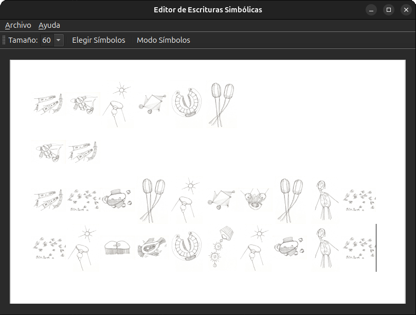
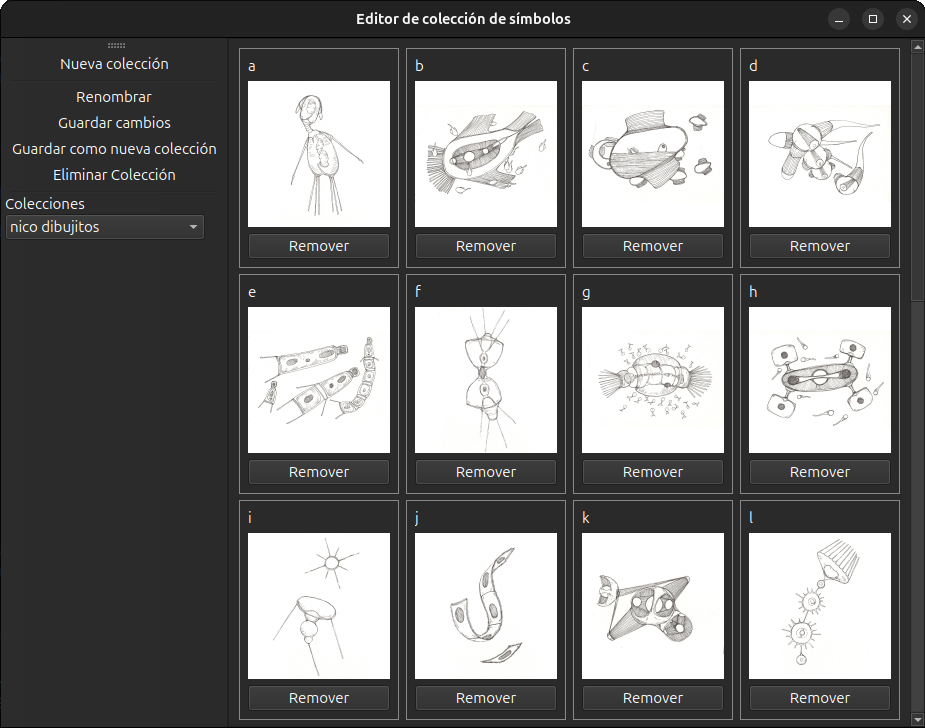

## Editor de escrituras simbólicas

Una aplicación que permite escribir texto usando un conjunto de imágenes como fuente para cada letra.       
Desarrollado como colaboración artística con [@duerme_volantina](https://www.instagram.com/duerme_volantina/).

## Propuesta
el mundo está lleno de objetos y formas     
cada una representa una experiencia, aparece como una sensación     
las letras tienen una presencia física, son trazadas y realizadas       
las letras, como cosas, nos suceden igual que las demás cosas del mundo     
cada uno tiene dentro su propio diccionario de fenómenos            
podemos crear y traducir todo a nuestros propios sistemas de símbolos       

  

  

